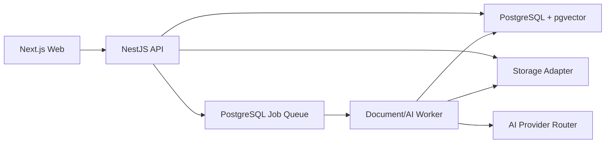

# EDUDOCS AI — MASTER PRODUCT & TECHNICAL SPECIFICATION V1

**Loại tài liệu:** Product Specification + UI/UX Specification + Technical Specification  
**Trạng thái:** Bản chuẩn để bắt đầu triển khai MVP  
**Tên sản phẩm:** EduDocs AI — tên làm việc, có thể đổi sau mà không thay đổi kiến trúc  
**Đối tượng đọc:** Chủ dự án, Codex, frontend developer, backend developer và người kiểm thử

---

## 0. Nguồn tham chiếu và thứ tự ưu tiên

### 0.1. Tài liệu đầu vào đã chốt

1. `Screenshot 2026-09-07 203520.png` — màn Thư viện tài liệu.
2. `Screenshot 2026-09-07 203703.png` — màn Chi tiết tài liệu + AI.
3. `stitch_ai_study_document_manager.zip` — `screen.png`, `code.html`, `DESIGN.md` của màn Thư viện.
4. `stitch_ai_study_document_manager (1).zip` — `screen.png`, `code.html`, `DESIGN.md` của màn Chi tiết.
5. `WEB_HOC_TAP_MVP_SCOPE_V1.md` — phạm vi sản phẩm.
6. `WEB_HOC_TAP_SITEMAP_USER_FLOW_V1.md` — sitemap và user flow.

### 0.2. Thứ tự xử lý khi có mâu thuẫn

1. Master Spec này quyết định chức năng, dữ liệu, API và hành vi.
2. Hai ảnh Stitch quyết định bố cục và cảm giác thị giác.
3. `DESIGN.md` trong ZIP quyết định design token.
4. `code.html` trong ZIP chỉ dùng để đo kích thước và nhận diện component; không dùng nguyên xi làm code production.
5. Các tài liệu cũ chỉ có giá trị tham khảo nếu không mâu thuẫn với Master Spec.

### 0.3. Quy tắc prototype

- Chỉ hai màn hình Stitch nói trên là prototype bắt buộc.
- Không cần thiết kế thêm Dashboard, Ngân hàng câu hỏi, Trình tạo đề, Làm bài hoặc Admin trước khi code.
- Màn hình chưa có prototype phải tái sử dụng app shell, design token và component được khóa trong tài liệu này.

---

# PHẦN I — PRODUCT SPECIFICATION

## 1. Tầm nhìn sản phẩm

EduDocs AI là web học tập giúp sinh viên biến tài liệu cá nhân thành nội dung ôn tập và bài kiểm tra có thể kiểm chứng.

Luồng giá trị cốt lõi:

> Upload tài liệu → trích xuất và chia nội dung → tìm kiếm/hỏi trong tài liệu → tạo hoặc nhập câu hỏi → duyệt câu hỏi → tạo bài kiểm tra → làm bài → xem kết quả.

Điểm khác biệt bắt buộc: mọi câu trả lời hoặc câu hỏi do AI tạo phải dựa trên tài liệu người dùng đã chọn và có căn cứ để kiểm tra lại.

## 2. Người dùng mục tiêu

### 2.1. Người dùng chính

- Sinh viên cần quản lý giáo trình, slide, ghi chú và tài liệu môn học.
- Sinh viên muốn tạo câu hỏi ôn tập nhanh từ tài liệu.
- Sinh viên muốn nhập sẵn bộ câu hỏi theo mẫu và làm bài như một bài kiểm tra cá nhân.

### 2.2. Vai trò MVP

| Vai trò | Quyền chính |
| --- | --- |
| `USER` | Quản lý dữ liệu cá nhân, dùng AI, tạo câu hỏi, tạo và làm bài kiểm tra |
| `ADMIN` | Quản lý tài khoản, theo dõi tác vụ lỗi và xử lý nội dung vi phạm |

MVP không tách vai trò Giáo viên/Học sinh và chưa có lớp học.

## 3. Nguyên tắc sản phẩm bắt buộc

1. Dữ liệu tài liệu mặc định là riêng tư.
2. AI không được dùng Internet hoặc kiến thức ngoài tài liệu cho tác vụ grounded.
3. Không đủ căn cứ thì trả về “Không tìm thấy thông tin này trong tài liệu hiện tại”.
4. Câu hỏi AI luôn là `DRAFT` cho đến khi người dùng duyệt.
5. MVP chỉ hỗ trợ trắc nghiệm A/B/C/D, đúng một đáp án.
6. Câu AI, câu nhập file và câu thủ công cùng dùng một Ngân hàng câu hỏi.
7. Không tự chuyển sang model trả phí.
8. Lỗi AI hoặc lỗi xử lý file không được làm mất file gốc hay dữ liệu người dùng đã nhập.
9. Mọi màn hình phải dùng được trên desktop, tablet và mobile.

## 4. Phạm vi MVP

### 4.1. Bao gồm

- Đăng ký, đăng nhập, đăng xuất, quên mật khẩu.
- Môn học/thư mục cá nhân.
- Upload và quản lý PDF, DOCX, TXT.
- Trích xuất văn bản từ PDF có text layer; chưa OCR.
- Chia tài liệu thành section/chunk và lập chỉ mục ngữ nghĩa.
- Tóm tắt, nhận diện chủ đề, tìm kiếm và hỏi đáp trong tài liệu.
- Tạo câu hỏi trắc nghiệm bằng AI.
- Nhập câu hỏi từ DOCX/TXT theo mẫu.
- Tạo/sửa/duyệt/xóa/sắp xếp câu hỏi.
- Tạo, xem trước, xuất bản và đóng bài kiểm tra.
- Làm bài, tự động chấm và xem lịch sử kết quả.
- Điều phối model AI chính và model dự phòng.
- Quản trị tài khoản và theo dõi tác vụ lỗi cơ bản.

### 4.2. Không bao gồm

- Cộng đồng chia sẻ tài liệu công khai.
- Lớp học, giao bài, mã lớp hoặc nhóm học sinh.
- Chống gian lận, webcam hoặc khóa trình duyệt.
- Tự luận, điền khuyết, ghép đôi hoặc nhiều đáp án đúng.
- Chấm tự luận bằng AI.
- OCR ảnh/PDF scan.
- AI tìm kiếm ngoài Internet.
- Mobile app native.
- Thanh toán/gói thuê bao.
- Thi trực tiếp nhiều người và leaderboard.

## 5. Sitemap và route sản phẩm

| Khu vực | Route frontend | Mục đích |
| --- | --- | --- |
| Đăng nhập | `/auth/login` | Đăng nhập |
| Đăng ký | `/auth/register` | Tạo tài khoản |
| Quên mật khẩu | `/auth/forgot-password` | Khôi phục tài khoản |
| Tổng quan | `/dashboard` | Tóm tắt hoạt động và thao tác nhanh |
| Môn học | `/subjects` | Quản lý môn học |
| Chi tiết môn | `/subjects/[subjectId]` | Tài liệu/câu hỏi/đề theo môn |
| Thư viện | `/documents` | Danh sách và upload tài liệu |
| Chi tiết tài liệu | `/documents/[documentId]` | Đọc tài liệu, tóm tắt, chủ đề, hỏi AI |
| Ngân hàng câu hỏi | `/questions` | Quản lý câu hỏi |
| Tạo bằng AI | `/questions/generate` | Cấu hình và duyệt câu AI |
| Nhập file | `/questions/import` | Import DOCX/TXT |
| Sửa câu hỏi | `/questions/[questionId]/edit` | Sửa nội dung/đáp án/căn cứ |
| Bài kiểm tra | `/tests` | Danh sách đề |
| Tạo đề | `/tests/new` | Tạo bài kiểm tra |
| Sửa đề | `/tests/[testId]/edit` | Cấu hình đề |
| Xem trước | `/tests/[testId]/preview` | Kiểm tra trước khi xuất bản |
| Làm bài | `/take/[testId]` | Trả lời câu hỏi; không hiển thị app shell |
| Kết quả | `/results` | Lịch sử làm bài |
| Chi tiết kết quả | `/results/[attemptId]` | Điểm và xem lại câu trả lời |
| Hồ sơ | `/settings/profile` | Tài khoản cá nhân |
| Admin | `/admin/users`, `/admin/jobs`, `/admin/content` | Quản trị cơ bản |

## 6. Yêu cầu chức năng

### 6.0. DASHBOARD — Tổng quan

- Hiển thị tổng số tài liệu, câu hỏi, bài kiểm tra và lượt làm của user hiện tại.
- Hiển thị tài liệu/bài kiểm tra/kết quả gần đây.
- Có lối tắt `Tải tài liệu`, `Tạo câu hỏi AI`, `Nhập file câu hỏi`, `Tạo bài kiểm tra`.
- Dashboard dùng lại app shell và component chuẩn; không cần hero, biểu đồ trang trí hoặc prototype riêng.

### 6.1. AUTH — Tài khoản

#### FR-AUTH-01 — Đăng ký

- Nhận email, mật khẩu, xác nhận mật khẩu và tên hiển thị.
- Email phải duy nhất và được chuẩn hóa lowercase.
- Mật khẩu tối thiểu 8 ký tự.
- Sau đăng ký thành công, người dùng được đăng nhập hoặc chuyển đến màn đăng nhập theo cấu hình.

#### FR-AUTH-02 — Đăng nhập/đăng xuất

- Đăng nhập bằng email + mật khẩu.
- Phiên đăng nhập dùng access token ngắn hạn và refresh session an toàn.
- Đăng xuất phải thu hồi refresh session hiện tại.

#### FR-AUTH-03 — Quên mật khẩu

- Tạo token một lần, có hạn sử dụng.
- Phản hồi không được tiết lộ email có tồn tại hay không.

#### FR-AUTH-04 — Phân quyền và ownership

- `USER` chỉ được đọc/sửa/xóa dữ liệu có `ownerId` của mình.
- `ADMIN` chỉ dùng quyền quản trị qua route/module riêng.
- Backend bắt buộc kiểm tra ownership; frontend ẩn nút không thay thế kiểm tra backend.

### 6.2. SUBJECT — Môn học

#### FR-SUBJECT-01

- Tạo, đổi tên, sửa mô tả và xóa môn học.
- Tên môn học bắt buộc, tối đa 100 ký tự.
- Khi xóa môn, người dùng chọn chuyển tài liệu về “Chưa phân loại” hoặc xóa mềm môn; không tự xóa tài liệu.

### 6.3. DOCUMENT — Tài liệu

#### FR-DOC-01 — Upload

- Hỗ trợ `.pdf`, `.docx`, `.txt`.
- Kích thước tối đa mặc định: `20 MB/file`, cấu hình bằng biến môi trường.
- Upload bằng multipart trong MVP.
- Lưu file gốc trước khi đẩy tác vụ xử lý nền.
- Phản hồi upload thành công trả về document với trạng thái `PROCESSING`.
- PDF scan/không có text layer trả về lỗi `NO_EXTRACTABLE_TEXT`; chưa chạy OCR.

#### FR-DOC-02 — Trạng thái

Chuỗi trạng thái:

`UPLOADING → PROCESSING → READY | FAILED`

- `READY`: có thể đọc, hỏi AI và tạo câu hỏi.
- `PROCESSING`: hiển thị “Đang xử lý”, không cho tạo câu hỏi.
- `FAILED`: hiển thị lý do dễ hiểu và hành động `Tải lại file` hoặc `Xóa`.
- Rời trang không làm hủy tác vụ.

#### FR-DOC-03 — Thư viện tài liệu

- Tìm theo tên file/tên hiển thị.
- Lọc theo môn học và trạng thái.
- Phân trang phía server.
- Mỗi hàng hiển thị: icon loại file, tên, định dạng/số trang/dung lượng, môn, trạng thái, thời gian cập nhật, hành động.
- Hành động theo trạng thái:
  - `READY`: `Học với AI`, tải xuống, đổi tên, chuyển môn, xóa.
  - `PROCESSING`: `Xem tiến trình`, xóa/hủy nếu tác vụ chưa bắt đầu.
  - `FAILED`: `Tải lại file`, xóa.
- Quota lưu trữ hiển thị từ API, không ghi cứng. Dữ liệu demo có thể dùng `4.8/10 GB` như prototype.

#### FR-DOC-04 — Chi tiết tài liệu

- Breadcrumb về Thư viện.
- Hiển thị tên, môn, định dạng, số trang, dung lượng và trạng thái.
- Trình đọc hỗ trợ chuyển trang, nhập số trang, zoom, tìm trong nội dung và toàn màn hình.
- Khi người dùng chọn một citation, trình đọc chuyển tới trang/chunk và highlight đoạn nguồn.
- Nút Primary duy nhất của phần header là `Tạo câu hỏi`.

#### FR-DOC-05 — Quản lý

- Đổi tên hiển thị không đổi tên storage key.
- Chuyển môn học.
- Tải file gốc.
- Xóa mềm document trước; tác vụ dọn file/chunk chạy nền.

### 6.4. AI — Phân tích và hỏi đáp

#### FR-AI-01 — Tóm tắt

- Sinh tóm tắt sau khi document `READY` hoặc khi người dùng yêu cầu.
- Tóm tắt ghi rõ phạm vi tài liệu đã dùng.
- Lưu phiên bản model/prompt để có thể tái tạo.

#### FR-AI-02 — Chủ đề

- Trả về danh sách chủ đề theo thứ tự xuất hiện.
- Mỗi chủ đề có title, short summary, page range và section/chunk references.

#### FR-AI-03 — Hỏi đáp grounded

- Chỉ truy xuất chunk thuộc tài liệu đang mở hoặc các tài liệu người dùng đã chọn.
- Câu trả lời có ít nhất một citation hợp lệ.
- Citation gồm tên tài liệu, trang/chương, source excerpt và `chunkId`.
- Có hành động `Nhảy tới vị trí này`.
- Không đủ căn cứ: trả `grounded=false`, `answer=null` và thông báo chuẩn; không suy đoán.

#### FR-AI-04 — Fallback model

- Thử model theo thứ tự cấu hình.
- Chỉ dùng provider/model có API key và được allowlist.
- Không dùng model trả phí khi `ALLOW_PAID_MODELS=false`.
- Mỗi tác vụ tối đa 2 lần thử trên một model và tối đa số provider đã cấu hình.
- Khi toàn bộ thất bại, job chuyển `FAILED`, lưu lỗi đã làm sạch và cho phép `Thử lại`.

#### FR-AI-05 — Tìm kiếm ngữ nghĩa

- Tìm trong các tài liệu thuộc user hiện tại bằng từ khóa và vector similarity.
- Cho phép giới hạn theo môn học hoặc danh sách tài liệu.
- Kết quả gồm tài liệu, trang/section, đoạn trích và relevance score đã chuẩn hóa.
- Bấm kết quả mở đúng tài liệu và vị trí nguồn.
- Tuyệt đối không trả chunk thuộc user khác, kể cả khi vector gần hơn.

### 6.5. QUESTION — Ngân hàng câu hỏi

#### FR-QUESTION-01 — Mô hình câu hỏi

- Nội dung câu hỏi.
- Đúng bốn lựa chọn A/B/C/D.
- Đúng một đáp án.
- Lời giải ngắn.
- Mức độ `EASY | MEDIUM | HARD`.
- Nguồn tạo `AI | IMPORT | MANUAL`.
- Trạng thái `DRAFT | APPROVED`.
- Citation bắt buộc với `AI`, tùy chọn với `IMPORT/MANUAL`.

#### FR-QUESTION-02 — Tạo bằng AI

Người dùng chọn:

- một hoặc nhiều tài liệu `READY`;
- toàn bộ tài liệu hoặc chủ đề;
- số lượng câu;
- mức độ.

Sau khi AI trả kết quả:

- backend validate schema và citation;
- giao diện hiển thị bản xem trước;
- người dùng sửa, xóa, tạo lại từng câu hoặc duyệt;
- chỉ câu được duyệt mới chuyển `APPROVED`.

#### FR-QUESTION-03 — Quản lý

- Tìm kiếm theo nội dung.
- Lọc theo môn, độ khó, nguồn tạo, trạng thái.
- Tạo/sửa/nhân bản/xóa câu hỏi.
- Chọn nhiều câu để thêm vào bài kiểm tra.

### 6.6. IMPORT — Nhập câu hỏi theo mẫu

#### FR-IMPORT-01 — Định dạng

- Hỗ trợ `.docx` và `.txt` UTF-8.
- Có nút tải file mẫu và trang hướng dẫn.
- Mẫu tối thiểu:

```text
Câu 1: HTTP là viết tắt của cụm nào?
A. HyperText Transfer Protocol
B. High Transfer Text Process
C. Hyper Tool Transfer Program
D. Home Text Transmission Protocol
Đáp án: A
Giải thích: HTTP là giao thức truyền tải siêu văn bản.
```

- `Giải thích` là tùy chọn; các trường còn lại bắt buộc.
- Parser chấp nhận `A.` hoặc `A)` nhưng chuẩn hóa về key A–D.

#### FR-IMPORT-02 — Preview và validation

- Không lưu trực tiếp sau upload.
- Tạo import session và preview từng câu.
- Lỗi hiển thị đúng câu và trường:
  - thiếu nội dung;
  - thiếu A/B/C/D;
  - lựa chọn trùng nhau sau trim/case normalization;
  - thiếu đáp án đúng;
  - đáp án đúng ngoài A–D;
  - file không có câu hợp lệ.
- Câu hợp lệ vẫn được giữ khi câu khác lỗi.
- Người dùng được sửa, thêm, xóa, sắp xếp rồi mới `Xác nhận nhập`.

### 6.7. TEST — Bài kiểm tra

#### FR-TEST-01 — Tạo đề

- Tên, mô tả, câu hỏi, thời gian hoặc không giới hạn.
- Cấu hình đảo câu, đảo đáp án, hiển thị lời giải sau nộp.
- Trạng thái `DRAFT | PUBLISHED | CLOSED`.
- Xem trước trước khi xuất bản.

#### FR-TEST-02 — Snapshot

- Khi `PUBLISHED`, mỗi câu trong đề lưu snapshot nội dung, options, correct option, explanation và điểm.
- Sửa câu trong Ngân hàng sau đó không làm thay đổi đề đã xuất bản.

#### FR-TEST-03 — Làm bài

- Trang làm bài tách khỏi app shell.
- Hỗ trợ chuyển câu, chọn đáp án và đánh dấu xem lại.
- Lưu nháp đáp án khi thay đổi và định kỳ.
- Backend quyết định thời gian hết hạn.
- Hết giờ tự nộp.
- Không cho submit một attempt hai lần.
- Khi đảo đáp án, chấm theo option ID/snapshot key ổn định, không dựa vào vị trí hiển thị.

### 6.8. RESULT — Kết quả

- Chấm tự động.
- Hiển thị điểm, đúng/sai/bỏ trống, thời gian làm.
- Xem từng câu và lời giải theo cấu hình đề.
- Lưu lịch sử attempt.

### 6.9. ADMIN — Quản trị cơ bản

- Xem danh sách user và trạng thái.
- Khóa/mở khóa user.
- Xem document/AI jobs lỗi theo loại và thời gian.
- Retry job an toàn.
- Xóa mềm nội dung vi phạm.
- Mọi thao tác admin ghi audit log.

---

# PHẦN II — UI/UX SPECIFICATION

## 7. Phong cách đã duyệt

Tên style trong Stitch: **Modern Educational SaaS**.

Đặc điểm:

- Sạch, học thuật, dễ đọc trong thời gian dài.
- Sidebar tối làm khung điều hướng; workspace sáng.
- Ưu tiên bảng, tài liệu và thông tin thật; không dùng card trang trí.
- Flat surface + border mảnh; gần như không dùng shadow.
- AI là panel hỗ trợ gắn với tài liệu.

## 8. Design token bắt buộc

### 8.1. Màu chính

| Token production | Giá trị | Vai trò |
| --- | --- | --- |
| `--color-primary` | `#5B5CE2` | CTA chính, nav active, tab active |
| `--color-primary-hover` | `#4C4DC9` | Hover CTA |
| `--color-primary-active` | `#3F40B3` | Active CTA |
| `--color-sidebar` | `#121A2E` | Sidebar |
| `--color-background` | `#F4F6FB` | Workspace |
| `--color-surface` | `#FFFFFF` | Topbar, table, panel, modal |
| `--color-surface-soft` | `#FAFBFD` | Toolbar/tab/header phụ |
| `--color-text` | `#192033` | Text chính |
| `--color-text-secondary` | `#687188` | Metadata/helper |
| `--color-border` | `#E1E5EE` | Border/divider |

### 8.2. Trạng thái

| Trạng thái | Background | Border | Text |
| --- | --- | --- | --- |
| Sẵn sàng | `#ECFDF3` | `#ABEFC6` | `#027A48` |
| Đang xử lý | `#FFFAEB` | `#FEDF89` | `#B54708` |
| Không đọc được | `#FEF3F2` | `#FECDCA` | `#B42318` |

Badge bắt buộc có nhãn chữ; dot/icon chỉ hỗ trợ, không thay nhãn.

### 8.3. Typography

- Font: `Inter`.
- Chỉ dùng weight `400` và `500`.

| Token | Desktop | Mobile | Weight |
| --- | --- | --- | --- |
| Page title | `28/36px` | `24/32px` | 500 |
| Section title | `20/28px` | `20/28px` | 500 |
| Body | `14/20px` | `14/20px` | 400 |
| Body medium | `14/20px` | `14/20px` | 500 |
| Metadata | `12/16px` | `12/16px` | 400/500 |

### 8.4. Spacing

Chỉ dùng scale: `4, 8, 12, 16, 20, 24, 32px`.

### 8.5. Radius

- Input/button: `10px`.
- Card/panel/table wrapper: `14px`.
- Modal: `18px`.
- Badge: `9999px`.

### 8.6. Elevation

- Card/table/panel nghỉ: không shadow, border `1px solid #E1E5EE`.
- Dropdown/popover: `0 4px 12px rgba(18,26,46,.06)`.
- Modal: backdrop `rgba(18,26,46,.40)`; một shadow nhẹ.
- Cấm glassmorphism, glow, neon, gradient nền và shadow nhiều lớp.

## 9. App shell

### Desktop ≥1280px

- Sidebar fixed `260px`.
- Header fixed cao `68px`, bắt đầu sau sidebar.
- Nội dung có `padding-left/right: 32px`, `padding-top/bottom: 28–32px`.
- Search topbar rộng tối đa `480px`.
- Sidebar gồm đúng bảy mục theo sitemap.
- Footer sidebar hiển thị quota từ API.

### Tablet 768–1279px

- Sidebar thu gọn thành rail hoặc drawer.
- Content padding `24px`.
- Chi tiết tài liệu chuyển về một cột khi hai cột không còn đủ rộng.

### Mobile <768px

- Sidebar nằm trong drawer; topbar có nút menu.
- Content padding `16px`.
- Table đổi thành list hoặc ẩn cột phụ nhưng giữ tên + trạng thái.
- Trình đọc nằm trên, AI panel nằm dưới.
- Không cuộn ngang toàn trang.
- Target chạm tối thiểu `44×44px`.

## 10. Component chuẩn

### 10.1. Button

- Primary: cao `40px`, padding ngang `16–18px`, background primary, text trắng, radius `10px`.
- Secondary: cao `40px`, surface, border, text chính.
- Ghost: transparent, text secondary.
- Mỗi vùng thị giác tối đa một Primary button.
- Có `hover`, `focus-visible`, `disabled`, `loading`.

### 10.2. Input/select

- Cao `40px`, padding ngang `12px`, radius `10px`.
- Focus: border primary + ring `0 0 0 3px rgba(91,92,226,.12)`.
- Placeholder dùng text secondary.
- Form quan trọng phải có label; placeholder không thay label.

### 10.3. Table

- Wrapper radius `14px`, border 1px.
- Header background `#F4F6FB`, text 12/500.
- Data row cao khoảng `64px` ở màn Thư viện.
- Hover chỉ đổi background nhẹ, không dịch chuyển.
- Tên tài liệu là action chính.
- Pagination ở footer table.

### 10.4. Tabs AI

- Đúng ba tab: `Tóm tắt`, `Chủ đề`, `Hỏi AI`.
- Active: text primary + border-bottom 2px primary.
- Tab chỉ đổi nội dung trong cùng panel, không đổi route.

### 10.5. Citation box

- Surface trắng, border, radius `8px`.
- Hiển thị trang/chương/mục, đoạn trích và `Nhảy tới vị trí này`.
- Bấm citation phải scroll/highlight đúng chunk trong viewer.

### 10.6. Icons

- Dùng một hệ icon duy nhất: Material Symbols Outlined như Stitch, hoặc ánh xạ toàn bộ sang một bộ icon duy nhất khi bắt đầu code.
- Không trộn nhiều icon set.
- Icon nav `20px`, inline `16–18px`.
- Icon-only button bắt buộc có accessible label.

## 11. Màn hình chuẩn 1 — Thư viện tài liệu

Ảnh chuẩn: `Screenshot 2026-09-07 203520.png`.

Thứ tự bố cục:

1. App shell.
2. Page title + mô tả.
3. Primary button `+ Tải tài liệu lên` ở bên phải.
4. Filter panel gồm search, môn học, trạng thái và reset.
5. Table tài liệu.
6. Footer: tổng số + pagination.

Các trạng thái mẫu bắt buộc trong Storybook/test fixture:

- PDF `READY`.
- DOCX `READY`.
- PDF `PROCESSING`.
- PDF `FAILED` do scan/không đọc được.
- Empty result sau filter.
- Loading table.
- Upload modal có validation.

## 12. Màn hình chuẩn 2 — Chi tiết tài liệu + AI

Ảnh chuẩn: `Screenshot 2026-09-07 203703.png`.

Desktop layout:

- Header document phía trên.
- Workspace `12-column grid`, gap `24px`.
- Viewer `7/12`, AI panel `5/12`.
- Viewer toolbar cao `48px`.
- Panel AI gồm header, tabs và content.

Các trạng thái bắt buộc:

- Tab `Tóm tắt`.
- Tab `Chủ đề`.
- Tab `Hỏi AI` với câu hỏi, câu trả lời, citation.
- Không đủ căn cứ.
- AI đang trả lời.
- AI/provider lỗi + nút thử lại.
- Citation được chọn và viewer highlight.

## 13. Quy tắc UI cho màn chưa có prototype

- Dùng nguyên app shell.
- Dùng page header giống Thư viện.
- List/table dùng cùng table component.
- Form dùng cùng input/button token.
- Status dùng cùng badge system.
- Không tự tạo dashboard hero, gradient card, glass panel hoặc màu môn học ngẫu nhiên.
- Không dùng lorem ipsum; dùng dữ liệu học tập tiếng Việt thực tế.

---

# PHẦN III — TECHNICAL SPECIFICATION

## 14. Kiến trúc tổng thể



### 14.1. Stack đã chốt

- Frontend: Next.js App Router + TypeScript + Tailwind CSS production build.
- Backend: NestJS + TypeScript.
- Database: PostgreSQL.
- Vector search: pgvector.
- ORM: Prisma cho dữ liệu quan hệ; raw SQL/migration kiểm soát phần vector nếu cần.
- Validation contract: Zod dùng chung ở frontend/contracts; backend DTO validation tương ứng.
- Background jobs: PostgreSQL-backed queue; không bắt buộc Redis trong MVP.
- Object/file storage: `StorageAdapter`.
- AI generation gateway ban đầu: OpenRouter qua OpenAI-compatible API; provider khác là adapter tùy chọn.

### 14.2. Ranh giới hệ thống

- Browser không gọi trực tiếp AI provider.
- API key chỉ tồn tại ở backend/worker.
- File extraction, embedding, summary và question generation chạy background job.
- Q&A có thể đồng bộ nếu dưới timeout; nếu provider chậm thì chuyển thành job/polling.
- Frontend polling trạng thái tài liệu/job mỗi 3–5 giây trong MVP; chưa cần WebSocket.

## 15. Cấu trúc repository

```text
edudocs-ai/
├─ apps/
│  ├─ web/
│  │  ├─ src/app/
│  │  │  ├─ (auth)/
│  │  │  ├─ (app)/documents/
│  │  │  ├─ (app)/subjects/
│  │  │  ├─ (app)/questions/
│  │  │  ├─ (app)/tests/
│  │  │  ├─ (app)/results/
│  │  │  ├─ take/[testId]/
│  │  │  └─ admin/
│  │  ├─ src/components/
│  │  │  ├─ layout/
│  │  │  ├─ ui/
│  │  │  ├─ documents/
│  │  │  ├─ ai/
│  │  │  ├─ questions/
│  │  │  └─ tests/
│  │  └─ src/lib/
│  └─ api/
│     ├─ src/modules/
│     │  ├─ auth/
│     │  ├─ users/
│     │  ├─ subjects/
│     │  ├─ documents/
│     │  ├─ storage/
│     │  ├─ jobs/
│     │  ├─ ai/
│     │  ├─ questions/
│     │  ├─ imports/
│     │  ├─ tests/
│     │  ├─ attempts/
│     │  └─ admin/
│     ├─ src/common/
│     ├─ src/main.ts
│     └─ src/worker.ts
├─ packages/
│  └─ contracts/
│     └─ src/
├─ prisma/
│  ├─ schema.prisma
│  └─ migrations/
├─ references/
│  └─ stitch/
├─ docs/
│  └─ EDUDOCS_AI_MASTER_SPEC_V1.md
├─ docker-compose.yml
├─ pnpm-workspace.yaml
└─ package.json
```

Không tách thêm microservice trong MVP.

## 16. Data model

Tất cả ID dùng UUID. Tất cả bảng có `createdAt`, `updatedAt` nếu phù hợp.

| Entity | Trường quan trọng | Ghi chú |
| --- | --- | --- |
| `User` | email, passwordHash, displayName, avatarUrl, role, status | email unique |
| `RefreshSession` | userId, tokenHash, expiresAt, revokedAt | không lưu refresh token thô |
| `PasswordResetToken` | userId, tokenHash, expiresAt, usedAt | one-time |
| `Subject` | ownerId, name, description, deletedAt | unique mềm theo owner/name |
| `Document` | ownerId, subjectId, displayName, originalName, mimeType, extension, sizeBytes, storageKey, checksum, pageCount, status, errorCode, errorMessage, deletedAt | ownership bắt buộc |
| `DocumentSection` | documentId, title, orderIndex, pageStart, pageEnd, contentText | cấu trúc tài liệu |
| `DocumentChunk` | documentId, sectionId, chunkIndex, contentText, pageStart, pageEnd, embedding | vector index |
| `DocumentAnalysis` | documentId, summary, topicsJson, model, promptVersion | một current version trong MVP |
| `AiJob` | ownerId, type, status, provider, model, attempts, inputJson, resultJson, errorCode, startedAt, finishedAt, tokenUsage | theo dõi job/fallback |
| `ChatThread` | ownerId, documentId, title | history theo tài liệu |
| `ChatMessage` | threadId, role, content, grounded, citationsJson, model | role USER/ASSISTANT |
| `Question` | ownerId, subjectId, sourceType, status, text, difficulty, explanation, correctOptionKey, sourceDocumentId | A–D, một đáp án |
| `QuestionOption` | questionId, key, text, orderIndex | exactly 4 |
| `QuestionCitation` | questionId, documentId, chunkId, pageStart, pageEnd, quote | bắt buộc với AI |
| `QuestionImport` | ownerId, subjectId, fileName, status, totalCount, validCount, invalidCount, errorsJson | preview session |
| `Test` | ownerId, title, description, durationMinutes, shuffleQuestions, shuffleOptions, showAnswers, status, publishedAt | personal test |
| `TestQuestion` | testId, questionId, orderIndex, points, snapshotJson | snapshot khi publish |
| `Attempt` | testId, userId, status, startedAt, expiresAt, submittedAt, score, correctCount, incorrectCount, unansweredCount | server time |
| `AttemptAnswer` | attemptId, testQuestionId, selectedOptionKey, markedForReview, isCorrect, answeredAt | unique attempt/question |
| `AuditLog` | actorId, action, entityType, entityId, metadataJson | admin/security |

### 16.1. Enum chính

```text
UserRole: USER | ADMIN
UserStatus: ACTIVE | LOCKED
DocumentStatus: UPLOADING | PROCESSING | READY | FAILED
AiJobStatus: QUEUED | RUNNING | SUCCEEDED | FAILED | CANCELLED
QuestionSourceType: AI | IMPORT | MANUAL
QuestionStatus: DRAFT | APPROVED
Difficulty: EASY | MEDIUM | HARD
TestStatus: DRAFT | PUBLISHED | CLOSED
AttemptStatus: IN_PROGRESS | SUBMITTED | GRADED
```

### 16.2. Vector constraint

- Một deployment chỉ dùng một embedding dimension cho cùng index.
- `EMBEDDING_PROVIDER`, `EMBEDDING_MODEL`, `EMBEDDING_DIMENSION` là cấu hình có kiểm soát.
- Không fallback tự động sang embedding model có dimension khác.
- Đổi embedding model/dimension yêu cầu re-index toàn bộ chunk.

## 17. Document processing pipeline

1. API kiểm tra MIME, extension, size và quota.
2. Tính checksum để phát hiện file trùng trong cùng user.
3. Lưu file gốc qua `StorageAdapter`.
4. Tạo `Document(PROCESSING)` và enqueue job.
5. Worker trích xuất:
   - PDF text layer: theo page.
   - DOCX: paragraph + heading.
   - TXT: UTF-8, normalize line ending.
6. Làm sạch ký tự điều khiển nhưng giữ heading/page mapping.
7. Tạo section.
8. Chia chunk mục tiêu khoảng 500–800 token, overlap 80–120 token.
9. Sinh embedding theo batch và ghi pgvector.
10. Sinh summary/topics bằng structured output.
11. Transaction cập nhật `READY`.
12. Nếu lỗi, lưu error code/message, chuyển `FAILED`; file gốc vẫn còn cho retry hoặc tải xuống.

Idempotency: retry không được tạo duplicate section/chunk; worker xóa/thay analysis version đang xây trong transaction.

## 18. RAG và AI contract

### 18.1. Retrieval

- Filter bắt buộc theo `ownerId` và selected `documentId` trước vector similarity.
- Lấy top 6–8 chunk phù hợp; ưu tiên đa dạng section/page.
- Không đưa toàn bộ tài liệu vào prompt nếu không cần.
- Mọi chunk gửi AI có `chunkId`, document name, page range và content.

### 18.2. Prompt safety

- Tài liệu là untrusted input.
- System prompt phải yêu cầu bỏ qua mọi câu lệnh/instruction nằm trong nội dung tài liệu.
- AI chỉ xem document chunk là dữ liệu tham khảo, không phải chỉ dẫn hệ thống.
- Không cho model gọi tool Internet trong grounded task.
- Giới hạn độ dài input/output và sanitize markdown nguy hiểm khi render.

### 18.3. Q&A output

```json
{
  "grounded": true,
  "answer": "Nội dung trả lời ngắn gọn...",
  "citations": [
    {
      "chunkId": "uuid",
      "pageStart": 14,
      "pageEnd": 14,
      "section": "3.1 & 3.2",
      "quote": "Đoạn căn cứ ngắn..."
    }
  ]
}
```

Không đủ căn cứ:

```json
{
  "grounded": false,
  "answer": null,
  "citations": [],
  "refusalReason": "NOT_FOUND_IN_SELECTED_DOCUMENTS"
}
```

Backend kiểm tra mọi `chunkId` thuộc tài liệu và user hiện tại trước khi trả frontend.

### 18.4. Question generation output

```json
{
  "questions": [
    {
      "text": "Câu hỏi...",
      "options": {
        "A": "Lựa chọn A",
        "B": "Lựa chọn B",
        "C": "Lựa chọn C",
        "D": "Lựa chọn D"
      },
      "correctOption": "A",
      "explanation": "Lời giải ngắn...",
      "difficulty": "MEDIUM",
      "citations": [
        {
          "chunkId": "uuid",
          "pageStart": 14,
          "pageEnd": 14,
          "quote": "Đoạn căn cứ..."
        }
      ]
    }
  ]
}
```

Validation bắt buộc:

- đúng 4 key A/B/C/D;
- options không rỗng và không trùng sau normalize;
- correctOption thuộc A–D;
- citation chunk thuộc selected documents;
- quote phải khớp hoặc gần khớp nội dung chunk;
- có explanation;
- số câu không vượt yêu cầu.

Output sai schema: cho model sửa output một lần; vẫn sai thì job `FAILED`, không lưu câu hỏi nửa vời.

### 18.5. Provider abstraction

```ts
interface LlmProvider {
  readonly name: string;
  generateStructured<T>(request: StructuredRequest<T>): Promise<LlmResult<T>>;
  generateGroundedAnswer(request: GroundedRequest): Promise<GroundedAnswer>;
  healthCheck(): Promise<boolean>;
}
```

Cấu hình:

```text
AI_PROVIDER_ORDER=openrouter,provider_b,provider_c
AI_MODEL_PRIMARY=<free-model-id>
AI_MODEL_FALLBACKS=<comma-separated-allowlist>
ALLOW_PAID_MODELS=false
AI_MAX_RETRIES_PER_MODEL=2
```

Không ghi model ID trực tiếp vào component hoặc business logic.

## 19. API specification

Base path: `/api/v1`.

### 19.1. Response envelope

Thành công:

```json
{
  "data": {},
  "meta": {}
}
```

Lỗi:

```json
{
  "error": {
    "code": "DOCUMENT_NOT_READY",
    "message": "Tài liệu vẫn đang được xử lý.",
    "fieldErrors": {}
  }
}
```

Không trả stack trace hoặc raw provider error cho client.

### 19.2. Endpoint chính

| Method | Endpoint | Chức năng |
| --- | --- | --- |
| POST | `/auth/register` | Đăng ký |
| POST | `/auth/login` | Đăng nhập |
| POST | `/auth/refresh` | Làm mới phiên |
| POST | `/auth/logout` | Đăng xuất |
| POST | `/auth/forgot-password` | Gửi reset |
| POST | `/auth/reset-password` | Đặt mật khẩu mới |
| GET/POST | `/subjects` | List/create môn |
| PATCH/DELETE | `/subjects/:id` | Sửa/xóa môn |
| GET | `/documents` | List/search/filter/page |
| POST | `/documents` | Upload multipart |
| GET | `/documents/:id` | Metadata/analysis |
| PATCH | `/documents/:id` | Đổi tên/chuyển môn |
| DELETE | `/documents/:id` | Xóa mềm |
| GET | `/documents/:id/content` | Page/section content |
| GET | `/documents/:id/download` | Download file gốc |
| POST | `/documents/:id/retry` | Retry processing |
| GET | `/documents/:id/summary` | Tóm tắt |
| GET | `/documents/:id/topics` | Chủ đề |
| POST | `/documents/:id/ask` | Q&A grounded |
| POST | `/search/semantic` | Tìm kiếm ngữ nghĩa trong tài liệu của user |
| GET/POST | `/ai/jobs` | List/create AI job |
| GET | `/ai/jobs/:id` | Poll job |
| POST | `/question-generations` | Tạo câu AI job |
| GET | `/questions` | List/filter câu hỏi |
| POST | `/questions` | Tạo thủ công |
| PATCH/DELETE | `/questions/:id` | Sửa/xóa |
| POST | `/questions/:id/approve` | Duyệt câu |
| POST | `/question-imports` | Upload DOCX/TXT |
| GET | `/question-imports/:id` | Preview/errors |
| PATCH | `/question-imports/:id/items/:itemId` | Sửa preview item |
| POST | `/question-imports/:id/commit` | Nhập câu hợp lệ |
| GET/POST | `/tests` | List/create đề |
| GET/PATCH/DELETE | `/tests/:id` | Chi tiết/sửa/xóa |
| POST | `/tests/:id/publish` | Publish + snapshot |
| POST | `/tests/:id/close` | Đóng đề |
| POST | `/tests/:id/attempts` | Bắt đầu làm bài |
| PATCH | `/attempts/:id/answers/:testQuestionId` | Autosave đáp án |
| POST | `/attempts/:id/submit` | Nộp bài idempotent |
| GET | `/attempts/:id/result` | Xem kết quả |
| GET | `/results` | Lịch sử |
| GET | `/admin/users` | Admin list user |
| PATCH | `/admin/users/:id/status` | Khóa/mở user |
| GET | `/admin/jobs` | Theo dõi job |
| POST | `/admin/jobs/:id/retry` | Retry job |

Endpoint hỏi AI dùng `/documents/:id/ask`; endpoint quản lý Ngân hàng câu hỏi là `/questions`. Hai loại nghiệp vụ không dùng chung route để tránh nhầm.

## 20. Frontend architecture

- Server state: query/cache library duy nhất; không lưu bản sao document/question list trong global store.
- Form: schema-first validation.
- Shared API types lấy từ `packages/contracts`.
- App shell là layout của `(app)` routes.
- `/take/[testId]` dùng layout riêng.
- Component theo domain; không tạo một file page chứa toàn bộ logic.
- Hai màn prototype được tách thành reusable components:
  - `AppSidebar`, `AppHeader`, `PageHeader`;
  - `DocumentFilters`, `DocumentTable`, `DocumentStatusBadge`, `UploadDocumentDialog`;
  - `DocumentViewer`, `DocumentToolbar`;
  - `AiDocumentPanel`, `AiTabs`, `CitationCard`, `GroundingNotice`.
- Không dùng HTML từ Stitch làm production page; chuyển thành React/Next components và token Tailwind.

## 21. Storage

```ts
interface StorageAdapter {
  put(input: PutObjectInput): Promise<StoredObject>;
  getStream(key: string): Promise<Readable>;
  delete(key: string): Promise<void>;
  createDownloadUrl(key: string, expiresInSeconds: number): Promise<string>;
}
```

- Development: local storage volume.
- Production: S3-compatible provider.
- Storage key là UUID/path nội bộ, không dùng trực tiếp filename do user cung cấp.
- Validate MIME bằng magic bytes khi có thể; không chỉ tin extension.
- Download dùng authorization + signed/streamed response.

## 22. Security và privacy

- Password hash bằng Argon2 hoặc thư viện password hashing được duyệt; không dùng SHA thuần.
- Refresh token lưu dạng hash, ưu tiên cookie `HttpOnly`, `Secure`, `SameSite` phù hợp.
- Rate limit cho auth, upload và AI endpoints.
- CSRF protection nếu dùng cookie auth cho state-changing request.
- CORS allowlist, không dùng `*` production.
- Ownership guard cho mọi query document/question/test/attempt.
- File type/size/quota validation.
- Filename sanitize và không dùng filename để tạo filesystem path.
- Render AI/markdown bằng sanitizer; cấm raw HTML mặc định.
- Prompt injection defense như mục 18.2.
- Log không chứa password, token, API key hoặc toàn bộ nội dung tài liệu.
- Xóa tài khoản/tài liệu phải có quy trình xóa file, chunk, citation và dữ liệu liên quan.
- Secret chỉ qua environment/secret manager; không commit `.env`.

## 23. Non-functional requirements

### Hiệu năng mục tiêu

- List/search metadata API p95 dưới 500ms trong dữ liệu MVP.
- UI phản hồi thao tác local dưới 100ms.
- Upload trả job trong 2 giây sau khi lưu file thành công, không chờ AI.
- Phân trang bắt buộc; không tải toàn bộ tài liệu/câu hỏi.
- Q&A có timeout rõ ràng và trạng thái retry.

### Reliability

- Job idempotent.
- Transaction cho publish test và submit attempt.
- Retry provider có giới hạn.
- Không mất file gốc khi analysis thất bại.
- Có health endpoints cho API, DB và worker.

### Accessibility

- WCAG AA cho tương phản.
- Keyboard navigation đầy đủ.
- Focus-visible không bị xóa.
- Icon-only control có accessible name.
- Dynamic status dùng aria-live phù hợp.
- Không phụ thuộc màu.

### Observability

- Structured logs có requestId/jobId/userId đã rút gọn.
- Log provider/model, latency, token usage nếu provider trả về.
- Không log raw API key hoặc full document text.
- Metrics tối thiểu: job success/fail, AI latency, fallback count, upload fail reason.

## 24. Testing strategy

### Unit

- File type/size validation.
- DOCX/TXT question parser.
- Question schema validator.
- Citation ownership/quote validator.
- AI provider fallback router.
- Test shuffle và grading.
- Attempt expiry.

### Integration

- Auth/session/ownership.
- Upload → job → READY/FAILED.
- Vector retrieval filtered theo user/document.
- AI invalid JSON retry/fail.
- Import preview/commit.
- Publish snapshot.
- Submit idempotency.

### E2E — Luồng bắt buộc

#### Flow A

1. Đăng ký/đăng nhập.
2. Upload PDF có text.
3. Chờ `READY`.
4. Xem tóm tắt/chủ đề.
5. Hỏi câu có căn cứ và nhảy tới citation.
6. Tạo câu hỏi AI.
7. Duyệt câu.
8. Tạo/publish/làm/nộp bài.
9. Xem kết quả.

#### Flow B

1. Upload TXT/DOCX câu hỏi theo mẫu.
2. Xem lỗi đúng theo câu.
3. Sửa và commit.
4. Tạo/publish/làm bài.
5. Xem kết quả.

### Visual regression

- Snapshot hai màn chuẩn ở desktop 1440px.
- Kiểm tra responsive tại 1024px, 768px, 390px và 320px.
- So sánh app shell, token, table, badge, viewer, AI panel và citation với ảnh Stitch.

## 25. Biến môi trường

```text
DATABASE_URL=
APP_URL=
API_URL=
JWT_ACCESS_SECRET=
JWT_REFRESH_SECRET=
STORAGE_DRIVER=local|s3
STORAGE_LOCAL_PATH=
S3_ENDPOINT=
S3_BUCKET=
S3_ACCESS_KEY_ID=
S3_SECRET_ACCESS_KEY=
MAX_UPLOAD_BYTES=20971520
DEFAULT_USER_QUOTA_BYTES=
AI_PROVIDER_ORDER=openrouter
OPENROUTER_API_KEY=
AI_MODEL_PRIMARY=
AI_MODEL_FALLBACKS=
ALLOW_PAID_MODELS=false
AI_MAX_RETRIES_PER_MODEL=2
EMBEDDING_PROVIDER=
EMBEDDING_MODEL=
EMBEDDING_DIMENSION=
```

Tạo `.env.example` chỉ có tên biến và giá trị mẫu không bí mật.

## 26. Milestone triển khai

Không chia thành quá nhiều micro-step. Dùng sáu milestone vừa/lớn:

### M0 — Foundation

- Monorepo, Next.js, NestJS, Prisma/Postgres/pgvector, contracts, auth skeleton, CI cơ bản.

### M1 — Documents + giao diện chuẩn

- App shell, hai màn Stitch, subject, upload/storage, document list/detail, processing job/extraction.

### M2 — RAG và AI

- Chunk/embedding, summary/topics, Q&A, citation/highlight, provider router/fallback.

### M3 — Question Bank + Import

- AI generation, manual CRUD, approval, DOCX/TXT parser, preview/commit.

### M4 — Tests + Attempts

- Builder, snapshot, publish, take, autosave, submit, grading, results.

### M5 — Hardening

- Admin cơ bản, security, quotas, accessibility, E2E, visual regression, deployment guide.

Mỗi milestone chỉ được đánh dấu hoàn thành khi lint, typecheck, unit/integration liên quan và production build đều pass.

## 27. Definition of Done của MVP

- Hai E2E flow ở mục 24 pass.
- AI grounded response luôn có citation hợp lệ hoặc từ chối đúng chuẩn.
- Không có đường truy cập chéo dữ liệu giữa hai user.
- Không tự dùng model trả phí.
- Câu hỏi AI sai schema không được lưu.
- Published test không đổi khi câu gốc bị sửa.
- Attempt không submit hai lần.
- Hai màn chuẩn khớp prototype về bố cục, token và hierarchy.
- Không cuộn ngang tại 320px.
- Build, lint, typecheck, tests pass.
- README có cách chạy local bằng một quy trình rõ ràng.
- `.env.example` không chứa secret.

## 28. Quy tắc thực thi dành cho Codex

1. Đọc toàn bộ Master Spec trước khi sửa code.
2. Đọc ảnh/ZIP Stitch trước khi triển khai M1.
3. Không dựng thêm tính năng ngoài MVP.
4. Không thay stack đã chốt nếu chưa báo lý do và được chấp thuận.
5. Không copy `code.html` Stitch nguyên xi; dùng nó làm reference.
6. Không đổi design token hoặc tự thêm UI style.
7. Không chia task thành micro-step; triển khai theo milestone.
8. Mỗi lần sửa phải chạy kiểm tra phù hợp và báo file đã thay đổi.
9. Không xóa/ghi đè thay đổi không liên quan của người dùng.
10. Khi gặp mâu thuẫn, áp dụng thứ tự ưu tiên ở mục 0.2.
11. Không đánh dấu hoàn thành nếu chỉ có UI giả nhưng chức năng/API chưa chạy.
12. Với AI, luôn lưu provider/model/job status và giữ đường fallback an toàn.

---

# PHẦN IV — QUYẾT ĐỊNH KHÓA

1. MVP là web học cá nhân dựa trên tài liệu, không phải bản sao đầy đủ của Azota.
2. Chỉ hai màn hình Stitch là prototype trực quan bắt buộc.
3. Ngân hàng câu hỏi là điểm hợp nhất cho AI/import/manual.
4. AI phải grounded và có citation.
5. Text generation có thể fallback nhiều provider; embedding không được đổi dimension tự động.
6. Không tự dùng model trả phí.
7. Next.js + NestJS + PostgreSQL/pgvector là kiến trúc nền.
8. Background processing không chờ trong request upload.
9. Published test dùng snapshot.
10. Master Spec này là nguồn chuẩn để bắt đầu triển khai.
